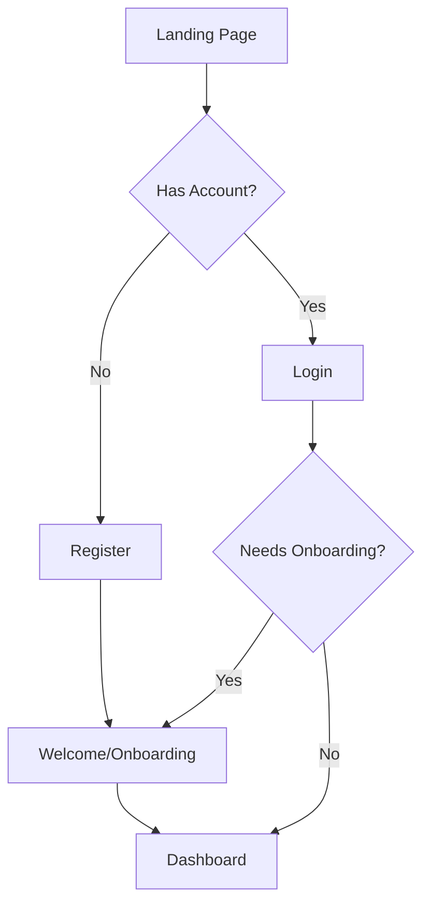

# Authentication Overview

## Core Components

### 1. Authentication Flow

### 2. Key Components
- **Landing Page** (`/pages/index.vue`)
  - Entry point for users
  - Redirects to login/register
  
- **Authentication Pages**
  - Login (`/pages/auth/login.vue`)
  - Register (`/pages/auth/register.vue`)
  
- **Onboarding** (`/pages/welcome.vue`)
  - 3-step process for new users
  - Profile completion
  - Preferences setup
  - Onboarding confirmation
  
- **Dashboard** (`/pages/dashboard/index.vue`)
  - Main application interface
  - Only accessible to authenticated users

### 3. Authentication Logic
- **Auth Composable** (`/composables/useAuth.ts`)
  - Centralized authentication logic
  - Session management
  - Profile/preferences management
  
- **Auth Middleware** (`/middleware/auth.ts`)
  - Route protection
  - Session validation
  - Onboarding status check

## State Management
- Supabase session state
- User profile state
- Onboarding status
- Loading states

## Security Considerations
- Route protection
- Session validation
- Token management
- Secure profile updates
