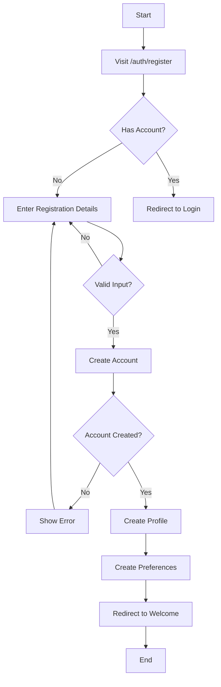
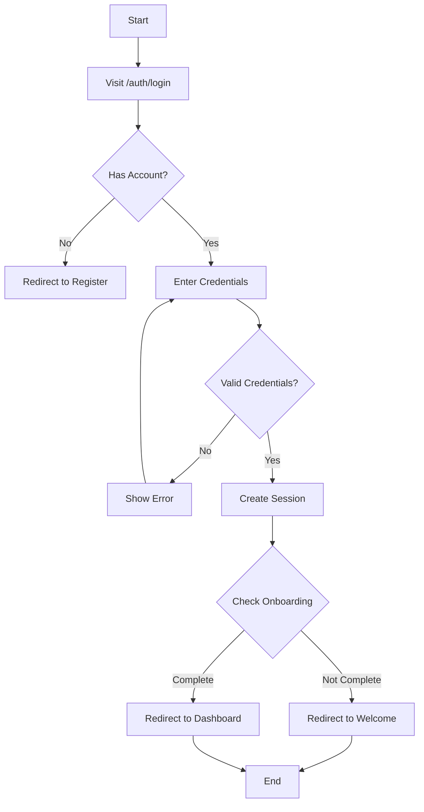
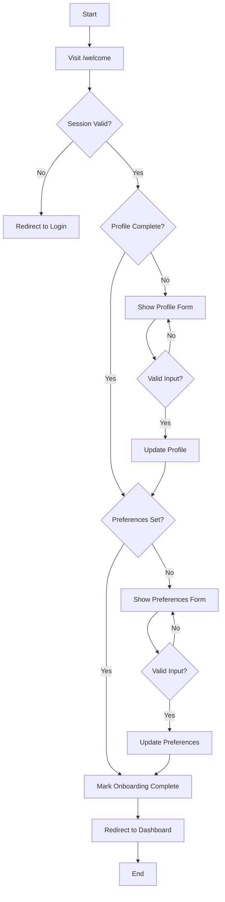
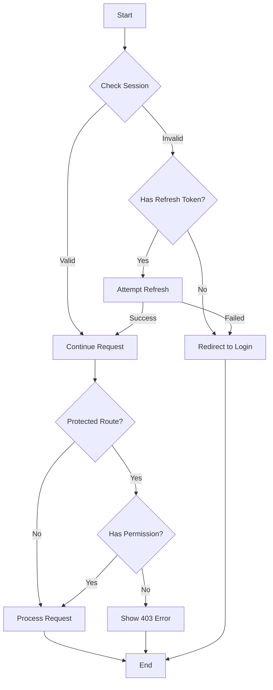
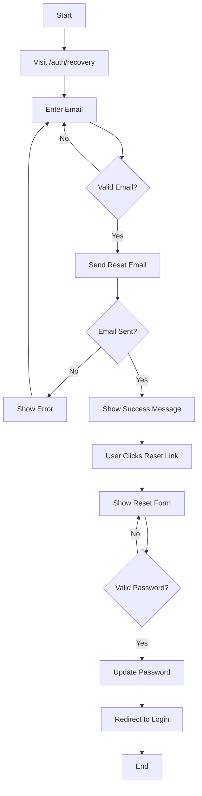
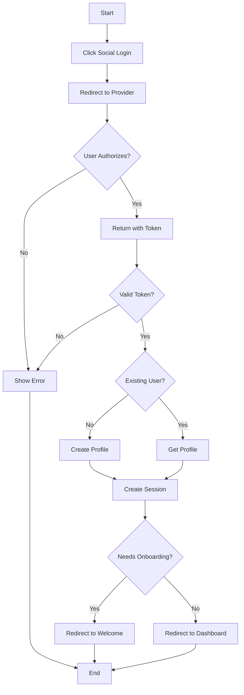

# Authentication Workflow

## 1. User Registration Flow

## 2. User Login Flow

## 3. Onboarding Flow

## 4. Session Management Flow

## 5. Password Recovery Flow

## 6. Social Authentication Flow

## Implementation Guidelines

### 1. Authentication States
- Unauthenticated
- Authenticated (No Profile)
- Authenticated (Incomplete Onboarding)
- Authenticated (Complete)

### 2. Protected Routes
- All routes except:
  - `/`
  - `/auth/login`
  - `/auth/register`
  - `/auth/reset-password`

### 3. Middleware Checks
1. Valid session exists
2. User profile exists
3. Onboarding completed (if required)
4. Proper role/permissions

### 4. Error Handling
- Invalid credentials
- Network errors
- Session expiration
- Profile update failures

### 5. Success Scenarios
- Successful registration
- Successful login
- Completed onboarding
- Profile updates
