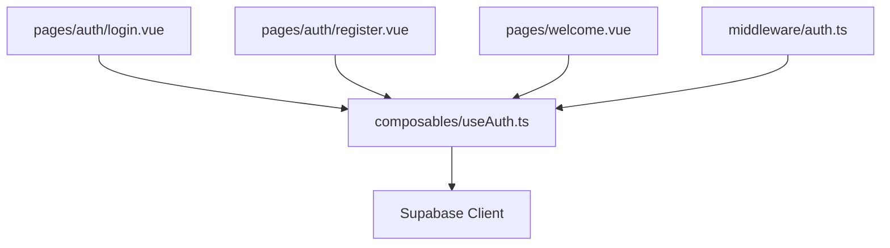
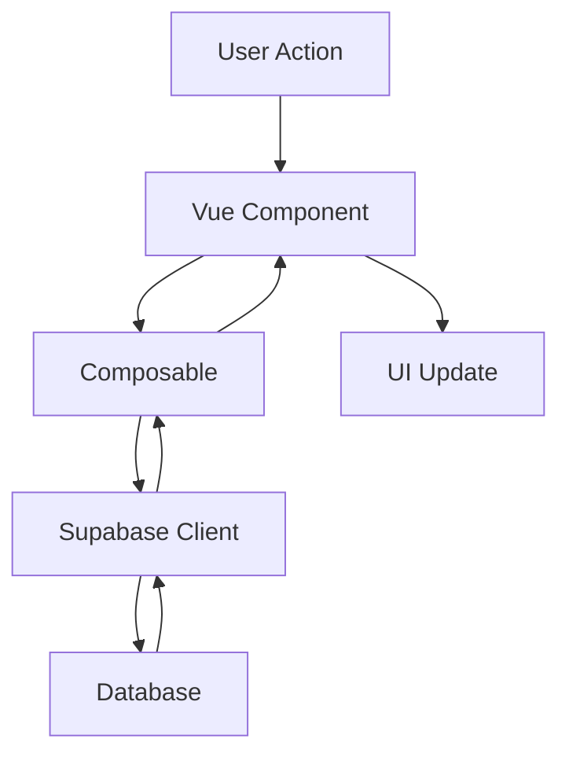

# Project Structure

## Core Directories

```
nuxt-supabase-crm-v2/
├── components/           # Reusable Vue components
│   └── ui/              # UI components (buttons, inputs, etc.)
├── composables/         # Vue composables
│   ├── useAuth.ts       # Authentication logic
│   └── useToast.ts      # Toast notifications
├── docs/               # Project documentation
│   └── authentication/  # Authentication documentation
│       ├── overview.md     # High-level overview
│       ├── workflow.md     # Detailed workflows
│       └── implementation.md # Implementation guide
├── layouts/            # Nuxt layouts
│   └── auth.vue        # Authentication layout
├── middleware/         # Nuxt middleware
│   ├── auth.ts         # Authentication route protection
│   └── guest.ts        # Guest-only routes
├── pages/             # Application pages
│   ├── index.vue      # Landing page
│   ├── dashboard/     # Dashboard pages
│   │   ├── index.vue          # Main dashboard
│   │   ├── users/            # User management (Admin)
│   │   │   ├── index.vue     # User list
│   │   │   └── [id].vue      # User details
│   │   ├── profile/          # User profile
│   │   │   └── [username]/   # Profile pages
│   │   │       ├── index.vue # Profile overview
│   │   │       └── settings.vue # Profile settings
│   │   ├── leads/           # Lead management
│   │   │   ├── index.vue    # Lead list
│   │   │   ├── new.vue      # New lead
│   │   │   └── [id]/        # Lead details
│   │   │       ├── index.vue # Overview
│   │   │       ├── tasks/    # Lead tasks
│   │   │       └── notes/    # Lead notes
│   │   ├── customers/       # Customer management
│   │   │   ├── index.vue    # Customer list
│   │   │   ├── new.vue      # New customer
│   │   │   └── [id]/        # Customer details
│   │   │       ├── index.vue # Overview
│   │   │       ├── opportunities/ # Sales opportunities
│   │   │       ├── communications/ # Communication history
│   │   │       └── documents/     # Customer documents
│   │   ├── calendar/        # Calendar management
│   │   │   ├── index.vue    # Calendar view
│   │   │   └── appointments/ # Appointments
│   │   └── settings/        # System settings
│   ├── auth/         # Authentication pages
│   │   ├── login.vue     # Login page
│   │   ├── register.vue  # Registration page
│   │   └── callback.vue  # OAuth callback
│   └── welcome.vue   # Onboarding flow
├── public/           # Static assets
├── types/           # TypeScript types
│   └── supabase.ts  # Database types
└── utils/           # Utility functions
    └── constants.ts # Application constants

## Feature Sections

### Authentication (/auth/)
- User login with email/password
- Social authentication
- New user registration
- Email verification
- Password recovery
- Security checks

### Users Management (/dashboard/users/)
- Creating/managing user accounts
- Assigning roles and permissions
- Managing access levels
- Viewing user activity logs
- Enabling/disabling accounts
- Managing system-wide user settings

### Profile Management (/dashboard/profile/@username/)
- Personal information management
- Password changes
- Notification preferences
- UI preferences
- Personal activity history
- Communication preferences

### Lead Management (/dashboard/leads/)
- Lead capture and entry
- Lead qualification and scoring
- Status tracking
- Follow-up management
- Conversion tracking
- Activity logging
- Task Integration:
  - Follow-up tasks
  - Contact tasks
  - Qualification tasks
  - Auto-task creation
  - Task templates
- Calendar Integration:
  - Follow-up scheduling
  - Meeting planning
  - Activity timeline
  - Reminder settings

### Customer Management (/dashboard/customers/)
- Customer profile management
- Communication history
- Purchase history
- Service records
- Document management
- Customer segmentation
- Account health tracking
- Task Integration:
  - Customer service tasks
  - Account management tasks
  - Meeting schedules
  - Follow-up reminders
- Calendar Integration:
  - Service appointments
  - Regular meetings
  - Follow-up scheduling
  - Availability booking

### Opportunity Management (/dashboard/customers/[id]/opportunities/)
- Deal tracking
- Pipeline management
- Stage progression
- Revenue forecasting
- Win/loss analysis
- Sales activity tracking
- Competitor tracking
- Stock integration:
  - Product selection
  - Stock availability
  - Stock reservation
  - Custom pricing
  - Stock allocation

### Calendar Management (/dashboard/calendar/)
- Appointment scheduling
- Event management
- Resource booking
- Availability tracking
- Integration with:
  - Tasks
  - Leads
  - Customers
  - Team members
- Features:
  - Multiple views (day, week, month)
  - Drag-and-drop scheduling
  - Recurring events
  - Reminder system
  - Schedule optimization

### System Settings (/dashboard/settings/)
- General settings
- User preferences
- System configuration
- Integration settings
- Security settings
- Backup and restore
- Audit logs
- Features:
  - Role management
  - Permission settings
  - System customization
  - Integration management
  - Data management

## Key Files and Their Responsibilities

### Authentication & Authorization
- `composables/useAuth.ts`: Core authentication logic
  - Session management
  - User authentication
  - Profile management
  - OAuth integration
  - Onboarding status

- `middleware/auth.ts`: Route protection
  - Session validation
  - Onboarding checks
  - Route redirection

- `middleware/guest.ts`: Guest route protection
  - Prevents authenticated users from accessing guest-only routes
  - Redirects to dashboard if authenticated

### Database Types
- `types/supabase.ts`: Supabase database types
  - Profile interface
  - UserPreferences interface
  - Database schema types

### Pages
- `pages/auth/login.vue`: Login page
  - Email/password login
  - Social authentication
  - Form validation
  - Error handling

- `pages/auth/register.vue`: Registration page
  - User registration
  - Form validation
  - Redirect to onboarding

- `pages/welcome.vue`: Onboarding flow
  - Multi-step onboarding
  - Profile completion
  - Preferences setup
  - Progress tracking

- `pages/dashboard/index.vue`: Main dashboard
  - User dashboard
  - Protected route
  - Requires completed onboarding

## Database Schema

```sql
-- User Profiles
create table profiles (
  id uuid references auth.users primary key,
  email text unique,
  full_name text,
  job_title text,
  company text,
  onboarding_completed boolean default false,
  created_at timestamp with time zone default timezone('utc'::text, now()),
  updated_at timestamp with time zone default timezone('utc'::text, now())
);

-- User Preferences
create table user_preferences (
  user_id uuid references auth.users primary key,
  email_notifications boolean default true,
  weekly_report boolean default true,
  timezone text default 'UTC',
  created_at timestamp with time zone default timezone('utc'::text, now()),
  updated_at timestamp with time zone default timezone('utc'::text, now())
);

-- Leads
create table leads (
  id uuid primary key default uuid_generate_v4(),
  owner_id uuid references auth.users,
  status text,
  score integer,
  company text,
  contact_name text,
  contact_email text,
  contact_phone text,
  source text,
  notes text,
  created_at timestamp with time zone default timezone('utc'::text, now()),
  updated_at timestamp with time zone default timezone('utc'::text, now())
);

-- Customers
create table customers (
  id uuid primary key default uuid_generate_v4(),
  owner_id uuid references auth.users,
  company_name text,
  industry text,
  status text,
  website text,
  created_at timestamp with time zone default timezone('utc'::text, now()),
  updated_at timestamp with time zone default timezone('utc'::text, now())
);

-- Opportunities
create table opportunities (
  id uuid primary key default uuid_generate_v4(),
  customer_id uuid references customers,
  owner_id uuid references auth.users,
  name text,
  stage text,
  amount decimal,
  probability integer,
  expected_close_date date,
  created_at timestamp with time zone default timezone('utc'::text, now()),
  updated_at timestamp with time zone default timezone('utc'::text, now())
);
```

## Access Control

### Role-Based Access
- Super Admin: Full system access
- Admin: System management
- Manager: Team and resource management
- Sales/Marketing Team: Role-specific views
- Standard User: Basic access

### Permission Levels
- Create: Add new records
- Read: View records
- Update: Modify records
- Delete: Remove records
- Manage: Administrative actions

## Security Implementation

### Authentication Security
- Password policies
- Session management
- Multi-factor authentication
- OAuth integration
- Rate limiting

### Data Security
- Row-level security
- Encryption at rest
- Secure communications
- Audit logging
- Backup procedures

## Development Guidelines

1. **Component Organization**
   - Keep components small and focused
   - Use composition API
   - Implement proper type checking

2. **State Management**
   - Use composables for shared state
   - Implement proper error handling
   - Maintain loading states

3. **Security**
   - Validate all inputs
   - Implement proper route protection
   - Handle session expiration

4. **Code Style**
   - Follow Vue 3 best practices
   - Use TypeScript for type safety
   - Document complex logic

5. **Testing**
   - Unit test composables
   - Integration test auth flows
   - E2E test critical paths

## Environment Setup

```env
# Supabase Configuration
NUXT_PUBLIC_SUPABASE_URL=your-project-url
NUXT_PUBLIC_SUPABASE_KEY=your-anon-key

# Application Settings
NUXT_PUBLIC_APP_NAME=CRM System
NUXT_PUBLIC_APP_URL=http://localhost:3000

# Feature Flags
NUXT_PUBLIC_ENABLE_SOCIAL_AUTH=true
NUXT_PUBLIC_ENABLE_MFA=false

# API Integration Keys (if needed)
NUXT_PRIVATE_SMTP_HOST=smtp.example.com
NUXT_PRIVATE_SMTP_USER=user
NUXT_PRIVATE_SMTP_PASS=pass
```

## Deployment Configuration

```javascript
// nuxt.config.ts
export default defineNuxtConfig({
  modules: [
    '@nuxtjs/supabase',
    '@nuxtjs/tailwindcss',
    '@pinia/nuxt',
  ],
  supabase: {
    redirect: false,
    redirectOptions: {
      login: '/auth/login',
      callback: '/auth/callback',
      exclude: ['/'],
    },
  },
  // ... other configuration
})
```

## Component Dependencies

### Authentication Flow


### Data Flow

